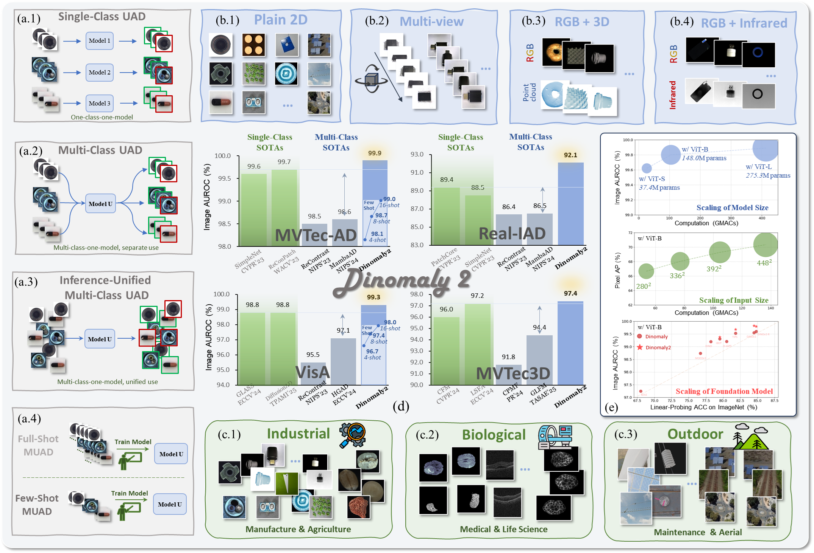
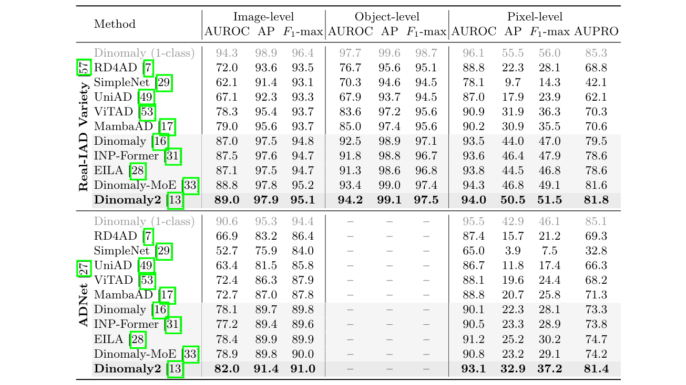

# Dinomaly2

PyTorch Implementation of
"One Dinomaly2 Detect Them All: A Unified Framework for Full-Spectrum Unsupervised Anomaly Detection".
(arxiv 2025)

- **Give me a ⭐️ if you like it.**
- This project is currently released under **Apache-2.0 License**. If your method is based on Dinomaly series, please acknowledge it in your work (papers, products, patents, competitions, etc.), preferably as a "Preliminary" section.
- Preview version. There might be some bugs, and some config is not exactly as in the paper.


## News
 - **_10.2025_**: We are thrilled to present the extended version of [Dinomaly](https://github.com/guojiajeremy/Dinomaly), now evolved into [**Dinomaly2**](https://arxiv.org/abs/2510.17611)!!! We introduce the first **unified framework** for **universal** UAD that seamlessly handles diverse _data modalities_ (2D, multi-view, RGB-3D, RGB-IR), _task settings_ (single-class, multi-class, inference-unified multi-class, few-shot) and application domains (industrial, biological, outdoor). Of course, Dinomaly2 achieves unprecedented UAD performance. Check it out😎
 - **_05.2026_**: **Preview Code released**🎉
 - **_05.2026_**: We now support super-large multi-class datasets: [Real-IAD_Variety](https://huggingface.co/datasets/Real-IAD/Real-IAD_Variety/tree/main) (160 classes)
and [ADNet](https://huggingface.co/datasets/linglingling009/ADNet) (380 classes). How great is that!🚀



## 1. Environments

Create a new conda environment and install required packages.

```
conda create -n my_env python=3.10
conda activate my_env
pip install -r requirements.txt
```
You can also try `requirements2.txt` which is simpler.

Our experiments are conducted on NVIDIA GeForce RTX 3090/4090/5090. 

## 2. Prepare Datasets
Noted that `../` is the upper directory of Dinomaly code. It is where we keep all the datasets by default.
You can also alter it according to your need, just remember to modify the `data_path` in the code. 

### MVTec AD

Download the MVTec-AD dataset from [URL](https://www.mvtec.com/company/research/datasets/mvtec-ad).
Unzip the file to `../mvtec_anomaly_detection`.
```
|-- mvtec_anomaly_detection
    |-- bottle
    |-- cable
    |-- capsule
    |-- ....
```


### VisA

Download the VisA dataset from [URL](https://github.com/amazon-science/spot-diff).
Unzip the file to `../VisA/`. Preprocess the dataset to `../VisA_pytorch/` in 1-class mode by their official splitting 
[code](https://github.com/amazon-science/spot-diff).

You can also run the following command for preprocess, which is the same to their official code.

```
python ./prepare_data/prepare_visa.py --split-type 1cls --data-folder ../VisA --save-folder ../VisA_pytorch --split-file ./prepare_data/split_csv/1cls.csv
```
`../VisA_pytorch` will be like:
```
|-- VisA_pytorch
    |-- 1cls
        |-- candle
            |-- ground_truth
            |-- test
                    |-- good
                    |-- bad
            |-- train
                    |-- good
        |-- capsules
        |-- ....
```
### BTAD

Download the BTAD dataset from [URL](https://www.kaggle.com/datasets/thtuan/btad-beantech-anomaly-detection).
Unzip the file to `../BTech_Dataset_transformed`.

### MPDD

Download the MPDD dataset from [URL](https://github.com/stepanje/MPDD).
Unzip the file to `../MPDD`.


### MIAD

Download the MIAD dataset from [URL](https://miad-2022.github.io/).
Unzip the file to `../MIAD`.

### Real-IAD
Download Real-IAD from [HF Link](https://huggingface.co/datasets/Real-IAD/Real-IAD).

Download and unzip `realiad_1024` and `realiad_jsons` in `../Real-IAD`.
`../Real-IAD` will be like:
```
|-- Real-IAD
    |-- realiad_1024
        |-- audiokack
        |-- bottle_cap
        |-- ....
    |-- realiad_jsons
        |-- realiad_jsons
        |-- realiad_jsons_sv
        |-- realiad_jsons_fuiad_0.0
        |-- ....
```

### Real-IAD_Variety
Download Real-IAD_Variety from [HF Link](https://huggingface.co/datasets/Real-IAD/Real-IAD_Variety/tree/main).

Download and unzip `realiadvariety_raw` and `realiadvariety_jsons` in `../Real-IAD_Variety`.

Unzip all zip files. Preprocess realiadvariety_raw (big raw images) to realiadvariety_1024 using `prepare_data/preprocess_realiadvar_mp`.
The training will be very slow without downsampling to 1024.

`../Real-IAD_Variety` will be like:
```
|-- Real-IAD
    |-- realiadvariety_1024
        |-- 2pin_block_plug
        |-- 3pin_aviation_connector
        |-- ....
    |-- realiad_jsons
        |-- 2pin_block_plug.json
        |-- 3pin_aviation_connector.json
        |-- ....
```

### MANTA-Tiny
Download MANTA-Tiny from [URL](https://figshare.com/articles/dataset/manta-tiny/27934938).

Unzip all files to `../MANTATiny` will be like:
```
|-- MANTATiny
    |-- agriculture
        |-- maize
        |-- paddy
        |-- soybean
        |-- ....
    |-- electronics
        |-- block_inductor
        |-- copper_standoff
        |-- ....
    |-- ....
```

### MVTec3D

Download the MVTec3D dataset from [URL](https://www.mvtec.com/research-teaching/datasets/mvtec-3d-ad).
Unzip the file to `../mvtec_3d`.

First, run `prepare_data/preprocess_mvtec3d_1`. Then run `prepare_data/preprocess_mvtec3d_2`. 
It will generalize depth maps to e.g. `mvtec_3d/bagel/test/hole/z`

### MulsenAD

Download the MulSenAD dataset from [URL](https://github.com/ZZZBBBZZZ/MulSen-AD).
Unzip the file to `../MulSen_AD`.


## 3. Run Experiments
2D MUAD (Conventional)
```
python dinomaly_2D.py --data_path ../mvtec_anomaly_detection --image_size 448 --crop_size 392 --save_name dinomaly2_mvtec
python dinomaly_2D.py --data_path ../VisA_pytorch/1cls --image_size 448 --crop_size 392 --save_name dinomaly2_visa
python dinomaly_2D.py --data_path ../MPDD --image_size 448 --crop_size 392 --save_name dinomaly2_mpdd
python dinomaly_2D.py --data_path ../BTech_Dataset_transformed --image_size 392 --crop_size 392 --save_name dinomaly2_btad
python dinomaly_2D.py --data_path ../MIAD --image_size 392 --crop_size 392 --save_name dinomaly2_miad
python dinomaly_2D.py --data_path ../Uni-Medical --image_size 280 --crop_size 280 --save_name dinomaly2_unimed
...
```

Multi-View MUAD
```
python dinomaly_multiview.py --data_path ../Real-IAD --image_size 448 --crop_size 392 --save_name dinomaly2_realiad
python dinomaly_multiview.py --data_path ../Real-IAD_Variety --image_size 280 --crop_size 280 --save_name dinomaly2_realiadvar
python dinomaly_multiview.py --data_path ../MANTATiny --image_size 280 --crop_size 280 --save_name dinomaly2_manta
```

RGB-3D MUAD
```
python dinomaly_mvtec3d.py --data_path ../mvtec_3d --image_size 448 --crop_size 392 --save_name dinomaly2_mvtec3d
```


RGB-IR MUAD
```
python dinomaly_mulsen.py --data_path ../MulSen_AD --image_size 448 --crop_size 392 --save_name dinomaly2_mulsen
```

Fewshot MUAD
```
python dinomaly_fewshot.py --data_path ../mvtec_anomaly_detection --image_size 448 --crop_size 392 --shots 4 --save_name dinomaly2_mvtec_fs4
```


## Some note
We now set the learning rate of first layer of NB to a smaller value for training stablility.

If you encounter training instability or Loss=NaN during training on other datasets (very rare in common datasets), simply use a smaller eps (1e-8 by default) in the LinearAttention2 module:

`        z = 1.0 / (torch.einsum('...sd,...d->...s', q, k.sum(dim=-2)) + self.eps)
`

## Acknowledgment
Great thanks to ADer, adeval, anomalib, and many other repositories (if I missed)

## Citation
```
@inproceedings{guo2025dinomaly,
  title={Dinomaly: The less is more philosophy in multi-class unsupervised anomaly detection},
  author={Guo, Jia and Lu, Shuai and Zhang, Weihang and Chen, Fang and Li, Huiqi and Liao, Hongen},
  booktitle={Proceedings of the Computer Vision and Pattern Recognition Conference},
  pages={20405--20415},
  year={2025}
}

@article{guo2025one,
  title={One Dinomaly2 Detect Them All: A Unified Framework for Full-Spectrum Unsupervised Anomaly Detection},
  author={Guo, Jia and Lu, Shuai and Fan, Lei and Li, Zelin and Di, Donglin and Song, Yang and Zhang, Weihang and Zhu, Wenbing and Yan, Hong and Chen, Fang and Li, Huiqi and Liao, Hongen},
  journal={arXiv preprint arXiv:2510.17611},
  year={2025}